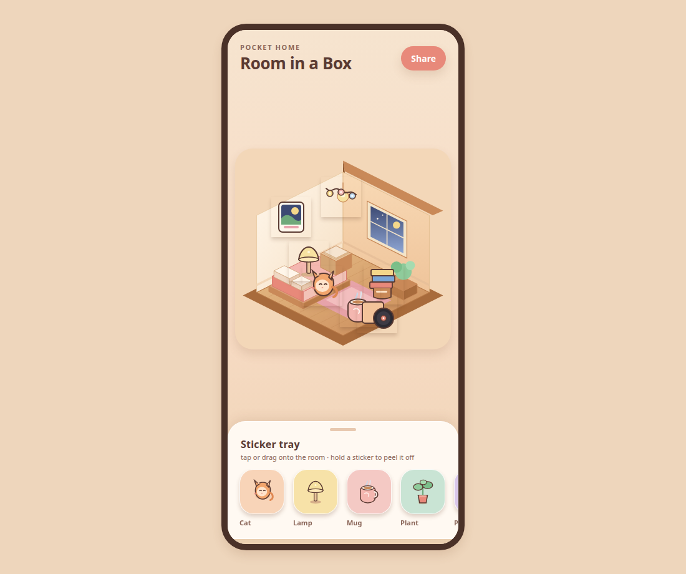

# Room in a Box

A cozy isometric sticker dollhouse — a pocket-home diorama you can play with in Expo.

## Screenshot



Open the app and you land on a warm clay/toy bedroom with a pre-decorated starter scene and a pastel sticker tray. Tap or drag stickers onto the room, then move them around. Long-press a placed sticker to peel it off.

## Run

```bash
npm install
npx expo start
```

Then:

- press `i` for iOS simulator
- press `a` for Android emulator
- press `w` for web
- scan the QR code with **Expo Go** on a phone

Web is framed as an iPhone-sized viewport so the sample reads like a phone app in the browser.

```bash
npx expo start --web
```

Typecheck:

```bash
npx tsc --noEmit
```

## Play

- **Tap** a tray sticker to drop it into the room
- **Drag** a tray sticker onto the diorama to place it
- **Drag** placed stickers to rearrange
- **Long-press** a placed sticker to remove it
- **Share** shows a sample alert (no-op)

## Stack

- Expo SDK 57 + TypeScript
- `react-native-svg` isometric room + die-cut sticker art (Expo Go / web friendly)
- `react-native-gesture-handler` + `react-native-reanimated` for drag and peel
- No backend, auth, or AI

## Layout

```
App.tsx                         root providers + phone shell
src/screens/RoomScreen.tsx      the star: room + tray + placement
src/room/IsometricRoom.tsx      cream walls, wood floor, bed, window, plant, rug
src/stickers/StickerArt.tsx     12 clay-style stickers
src/components/StickerTray.tsx  bottom horizontal tray
src/components/DraggableSticker.tsx
```
